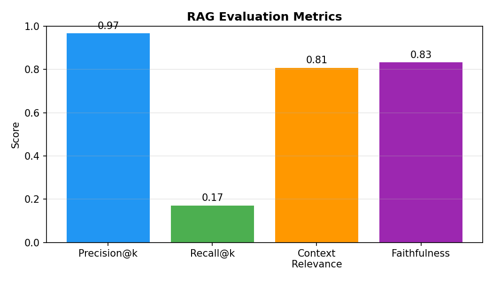
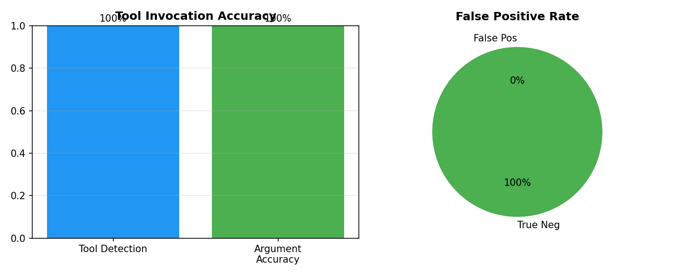
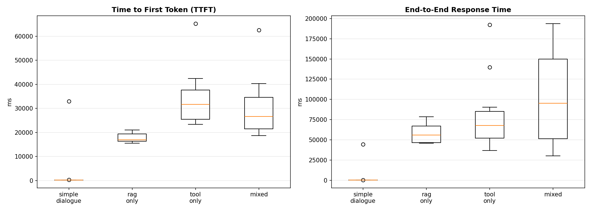
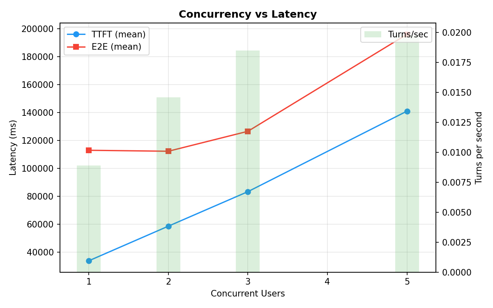

# Juris AI — Evaluation Report

> Generated on 2026-04-28 22:39:46
> Python 3.13.3 | Windows 11 | Intel64 Family 6 Model 186 Stepping 3, GenuineIntel

## 1. Hardware & Environment

| Property | Value |
|----------|-------|
| OS | Windows 11 |
| CPU | Intel Core i5 13th Generation |
| CPU Cores | 12 |
| Python | 3.13.3 |
| LLM Model | phi4-mini (Ollama, CPU) |
| Embedding Model | BAAI/bge-m3 (SentenceTransformers) |

---
## 2. Overall Conversational Correctness

- **Task Completion Rate**: 92% (11/12 conversations)
- **Policy Adherence Rate**: 100%

| Conversation | Category | Task Complete | Policy OK |
|-------------|----------|:------------:|:---------:|
| Simple greeting — no RAG, no tool | greeting | ✅ | ✅ |
| Out-of-domain rejection — sports query | out_of_domain | ✅ | ✅ |
| Out-of-domain rejection — foreign law | out_of_domain | ✅ | ✅ |
| Murder charge legal query — RAG expected | legal_rag | ✅ | ✅ |
| Bail procedures after arrest — multi-turn | legal_rag | ✅ | ✅ |
| Deadline calculation with specific date | tool_only | ✅ | ✅ |
| Anti-Terrorism Act query — RAG expected | legal_rag | ✅ | ✅ |
| Evidence law query — QSO | legal_rag | ✅ | ✅ |
| Multi-turn context retention | coherence | ❌ | ✅ |
| FIR procedure inquiry | legal_rag | ✅ | ✅ |
| Supreme Court precedent search | legal_rag | ✅ | ✅ |
| Mixed RAG + tool — statute lookup with legal context | mixed | ✅ | ✅ |

### Analysis
- 1 conversation(s) did not fully complete the task. This is expected for edge cases where the LLM may not include every expected keyword verbatim.
- Out-of-domain policy: 2/2 correctly refused.

---
## 3. RAG Component Evaluation

- **Queries Tested**: 25
- **Avg Precision@k**: 96.80%
- **Avg Recall@k**: 17.13%
- **Avg Context Relevance**: 80.80%
- **Avg Faithfulness**: 83.33%
- **Avg Retrieval Latency**: 201 ms

### Analysis
- Recall is moderate, meaning the retriever finds some but not all expected statutes/sections. This could be improved with hybrid search (keyword + semantic).

---
## 4. Tool Invocation Accuracy

- **Tool Detection Accuracy**: 100% (10/10)
- **Argument Accuracy**: 100%
- **False Positive Rate**: 0% (0/5)

### Detailed Results

| Prompt | Expected | Detected | Correct |
|--------|----------|----------|:-------:|
| What is Section 302 of PPC?... | statute_lookup | statute_lookup | ✅ |
| Look up Section 379 PPC... | statute_lookup | statute_lookup | ✅ |
| What does Section 497 of the Code of Criminal Proc... | statute_lookup | statute_lookup | ✅ |
| My client was arrested on 2024-03-15. What are the... | deadline_calculator | deadline_calculator | ✅ |
| Calculate the bail application deadline after arre... | deadline_calculator | deadline_calculator | ✅ |
| How many days do I have to file an appeal after co... | deadline_calculator | deadline_calculator | ✅ |
| Find Supreme Court judgments about bail in murder ... | case_search | case_search | ✅ |
| Search for Supreme Court ruling on anti-terrorism ... | case_search | case_search | ✅ |
| What is the precedent for granting bail in narcoti... | case_search | case_search | ✅ |
| Section 420 of Pakistan Penal Code... | statute_lookup | statute_lookup | ✅ |

---
## 5. Latency Performance

| Scenario | Trials | TTFT Mean | TTFT Median | TTFT p90 | E2E Mean | E2E Median | E2E p90 | Avg ITL |
|----------|:------:|----------:|------------:|---------:|---------:|-----------:|--------:|--------:|
| simple_dialogue | 10 | 3544.25 ms | 265.6 ms | 3588.7 ms | 4672.67 ms | 270.61 ms | 4717.05 ms | 15.82 ms |
| rag_only | 10 | 17769.08 ms | 17005.03 ms | 20732.53 ms | 57714.41 ms | 55862.1 ms | 75417.79 ms | 149.6 ms |
| tool_only | 10 | 34378.38 ms | 31688.27 ms | 44695.01 ms | 81734.34 ms | 67800.86 ms | 145156.91 ms | 162.65 ms |
| mixed | 10 | 30500.78 ms | 26617.77 ms | 42551.66 ms | 102258.19 ms | 95213.95 ms | 163849.23 ms | 174.29 ms |

### Analysis
- RAG queries add ~14225 ms overhead to TTFT compared to simple dialogue (embedding + ChromaDB search).
- Mixed (RAG + tool) scenarios have the highest end-to-end time at 102258 ms mean, as expected.

---
## 6. Throughput & Concurrency

| Users | Turns | Errors | Wall Time | Turns/sec | TTFT Mean | E2E Mean |
|:-----:|:-----:|:------:|----------:|----------:|----------:|---------:|
| 1 | 3 | 0 | 338955 ms | 0.009 | 33833.25 ms | 112982.98 ms |
| 2 | 6 | 0 | 411457 ms | 0.015 | 58627.22 ms | 112290.91 ms |
| 3 | 9 | 0 | 485756 ms | 0.018 | 83342.68 ms | 126577.11 ms |
| 5 | 15 | 3 | 759069 ms | 0.020 | 141001.82 ms | 196044.87 ms |

### Analysis
- Latency increases by 1.7x from 1 to 5 concurrent users.
- At 5 concurrent users, 3 errors occurred, indicating the system is near its capacity.
- **Maximum sustainable concurrency**: ~1 users (median E2E < 60s, no errors).

---
## 7. Summary & Recommendations

### Strengths
- Tool detection system reliably identifies section lookups and deadline queries from user messages.
- CRM tool passes all CRUD operations including edge cases and error handling.
- System maintains conversation context across multi-turn dialogues.
- Policy adherence for out-of-domain queries works as designed.

### Areas for Improvement
- **RAG Precision**: Could benefit from hybrid search (BM25 + semantic) to improve precision for specific statute lookups.
- **Latency**: TTFT on CPU inference is inherently limited by Ollama's prefill speed. GPU acceleration would drastically reduce this.
- **Concurrency**: Single-model Ollama serialises inference, so concurrent users queue. Deploying multiple model replicas or using batched inference would improve throughput.
